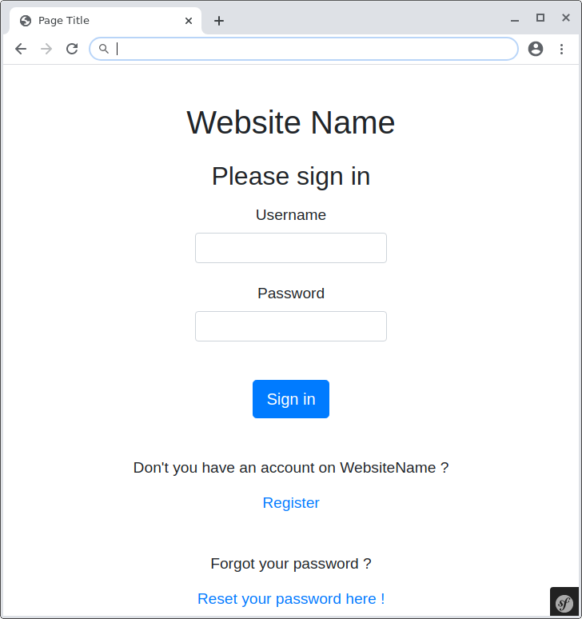
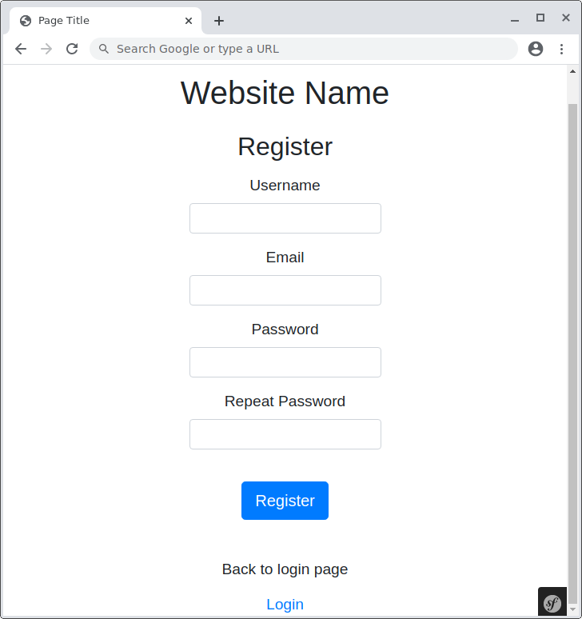
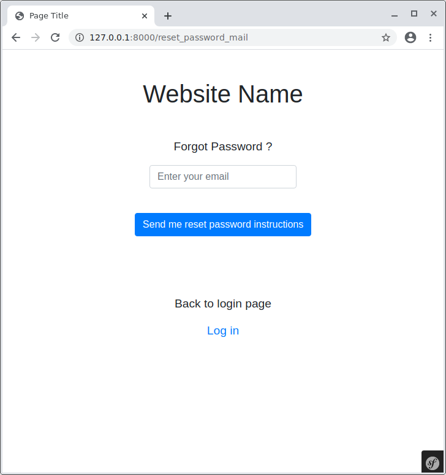
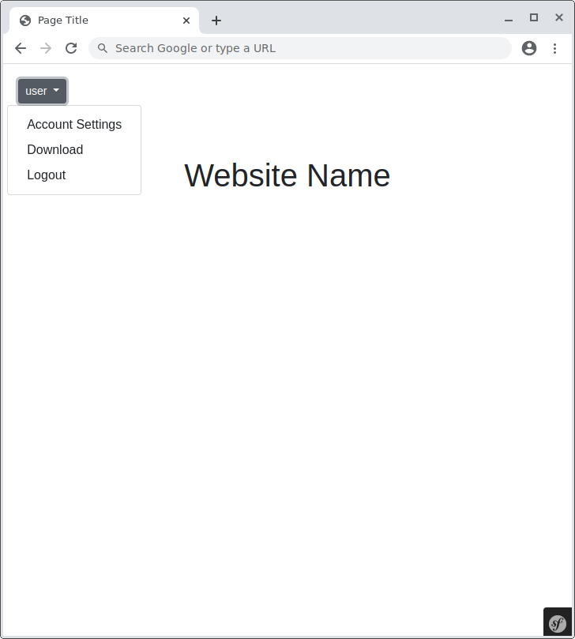
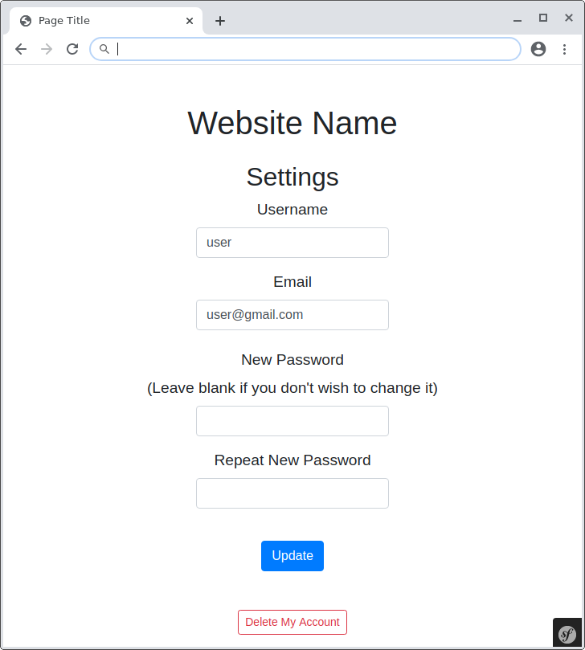

# Simple Symfony_5_admin_panel

### Symfony version : 5.0.7

To do :
1. `` git clone git@github.com:jonatanbzk/testSymf.git ``
2.  `` composer install ``
3. config
- `` cp .env.dist .env ``
- modify **APP_SECRET=**
- change **DATABASE_URL=mysql://root:@127.0.0.1:3306/dictionary?serverVersion=5.7**
- change **MAILER_URL=gmail://senderEmailAdress@gmail.com:password@localhost**
4. Migrate DB : https://symfony.com/doc/current/doctrine.html#migrations-creating-the-database-tables-schema
5. Customize **public/css/style.cdd file** ,  **src/Controller/Mailer/Email.php** ...

 

#### Following fully functional pages are provided :

___

 

A landing page, allowing a user to log in to the admin panel.

 

A registration page, where future users can create their accounts.

 

A page to reset the user's password.

 

A home page where users are redirected after login.

 

A setting page, allowing a user to update own e-mail address and / or password.
